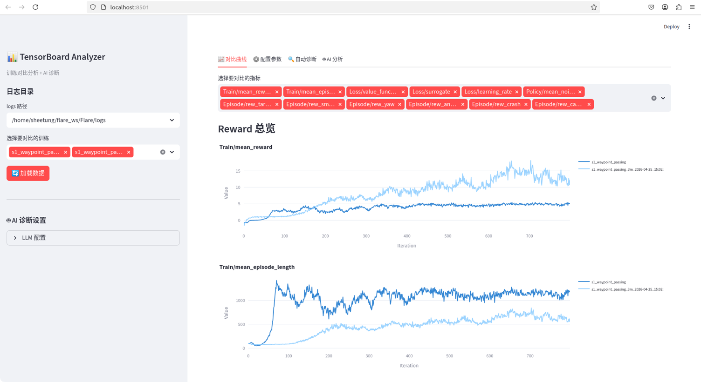
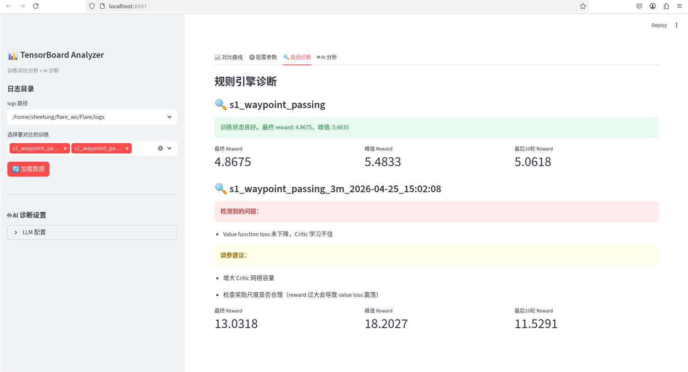
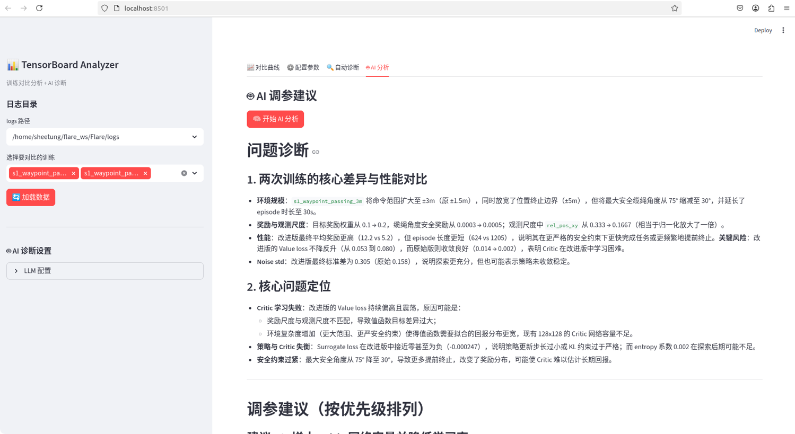

# TensorBoard Analyzer

基于 Streamlit 的训练分析工具，支持 TensorBoard 数据对比和大模型 AI 诊断调参。

## 功能

- **对比曲线**：选择多个训练目录，展示 reward / loss 等指标的对比折线图
- **配置参数**：查看每次训练的完整配置
- **自动诊断**：规则引擎检测常见问题（reward 不增长、碰撞率高、噪声不收敛等）并给出调参建议
- **AI 分析**：将训练指标 + 配置发送给大模型，生成针对性的调参建议

## 界面展示

### 对比曲线



### 自动诊断



### AI 分析



## 安装

```bash
git clone https://github.com/sheetung/TensorBoard-Analyzer
cd TensorBoard-Analyzer

python -m venv .venv
source .venv/bin/activate

uv pip install -r requirements.txt

# 创建环境变量配置
cp .env.example .env
```

复制后可按需编辑 `.env`：

```bash
# 日志目录（留空则自动扫描上级目录下的 logs 文件夹）
LOGS_DIR=/path/to/your/logs

# System Prompt（AI 角色设定，一般不需要改）
SYSTEM_PROMPT=...

# User Prompt（项目背景和特殊需求描述）
USER_PROMPT=我正在训练四旋翼无人机的绳索悬挂负载系统...
```

## 使用

```bash
streamlit run app.py
```

浏览器打开 `http://localhost:8501`。

### 基本流程

1. 左侧栏自动扫描上级目录下的 logs 文件夹
2. 选择要对比的训练（支持多选）
3. 点击「加载数据」
4. 在 Tab 页中查看对比曲线、配置参数、自动诊断结果
5. 配置 LLM API Key 后，点击「AI 分析」获取大模型调参建议

### LLM 配置

支持多种大模型 Provider：

| Provider | 模型示例 | 说明 |
|----------|----------|------|
| deepseek | deepseek-v4-flash | DeepSeek |
| openai | gpt-4o | OpenAI GPT |
| anthropic | claude-sonnet-4-20250514 | Anthropic Claude |
| ollama | llama3 | 本地部署 |

在左侧栏「AI 诊断设置」中填写 API Key 即可，首次保存后自动持久化到 `llm_config.json`（已加入 .gitignore）。

## 项目结构

```
TensorBoard-Analyzer/
├── app.py            # Streamlit 主入口（4 个 Tab）
├── analyzer.py       # TensorBoard 数据读取 + 规则诊断
├── llm_advisor.py    # 多模型 LLM 调用（OpenAI / Anthropic SDK）
├── requirements.txt  # Python 依赖
├── .env.example      # 环境变量模板
├── .gitignore
└── README.md
```

## 自动诊断规则

| 问题 | 检测条件 | 建议 |
|------|----------|------|
| Reward 下降 | 后半程均值低于前半程 90% | 降低学习率 / 增大 entropy |
| 局部最优 | Reward 波动小但低于峰值 | 增大噪声 / 增大网络 |
| 碰撞率高 | crash 惩罚绝对值 > 0.5 | 增大 crash 惩罚权重 |
| 安全约束惩罚高 | safety 惩罚绝对值 > 0.01 | 放宽安全阈值 / 降低惩罚权重 |
| 噪声不收敛 | 最终噪声 > 初始噪声 80% | 增加训练轮数 / 调学习率 |
| Value loss 不下降 | 最终 loss > 初始 loss 90% | 增大 Critic 网络 / 检查奖励尺度 |
